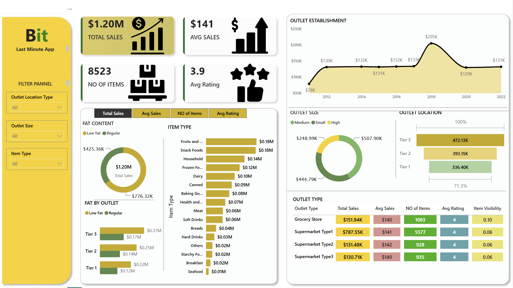
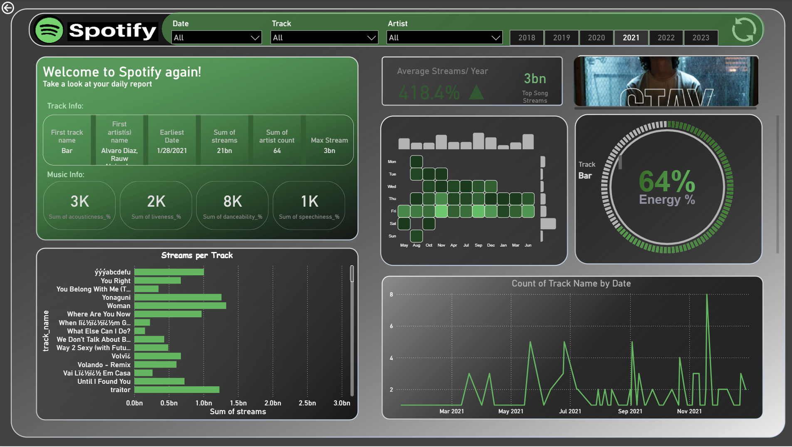

# Power BI Dashboards
### Data Visualization Portfolio | Nasim Maleki

---

## Overview

This repository brings together two interactive Power BI dashboards built on two very different datasets. Each one was designed not just to display numbers, but to turn raw data into a clear story that a manager or decision maker could read at a glance.

The two projects are intentionally different in topic and visual style, to show flexibility across both business reporting and consumer analytics, and across both light corporate and dark themed design.

---

## The Dashboards

### 1. Retail Sales Dashboard — "Bit"
An interactive sales dashboard for a retail business, analysing performance across outlets, item types, and locations. It surfaces total and average sales, item counts, customer ratings, and outlet level breakdowns, all filterable by location, outlet size, and product type.

[View the dashboard and details →](retail_sale_analysis)

---

### 2. Spotify Streaming Dashboard
A music analytics dashboard built on Spotify streaming data, exploring the most streamed songs across years. It combines streaming volume, audio features (energy, danceability, acousticness), and listening patterns into a polished, Spotify themed interface.

[View the dashboard and details →](Spotify Streaming Analysis/)

---

## Skills Demonstrated

- **Power BI dashboard design** — layout, theming, and visual hierarchy
- **DAX** — calculated measures and dynamic logic
- **Data visualization and storytelling** — turning raw data into clear, decision ready insight
- **Advanced visuals** — custom charts using external tools such as Deneb and dynamic HTML
- **Data preparation** — Python and API based data processing before modeling

---

## A Note on the Source Files

The dashboards are shared here as high resolution screenshots together with full documentation of the data, design, and insights. The original `.pbix` files are large because of embedded data, and are available on request.

**Contact:** nasimmaleki.official@gmail.com

---

*Nasim Maleki · Business Analyst · Bremen, Germany*
*[LinkedIn](https://linkedin.com/in/nasim-maaleki)*# powerbi-dashboards
